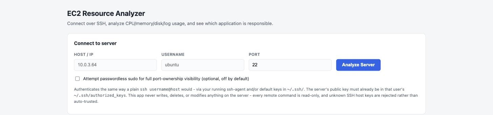

# EC2 Resource Analyzer


**SSH into a Linux EC2 server, and get a straight answer to: what's running,
what's eating CPU/memory, and what's eating disk/logs — with every process
correctly correlated back to a real application, not just a raw command
line.**

A local web app (FastAPI + vanilla JS, no cloud component) that connects to
your server over SSH, runs a single bounded read-only analysis, and renders
a dashboard: server health, top processes, disk usage, running
applications, port→application mapping, and plain-English findings.

```
Browser  →  localhost web app  →  SSH  →  EC2  →  collect + correlate  →  dashboard
```



---

## Contents

- [Why this exists](#why-this-exists)
- [Quick start](#quick-start)
- [What it collects](#what-it-collects)
- [Precise application identification](#precise-application-identification)
- [Port → application mapping](#port--application-mapping)
- [Security](#security-notes-and-tradeoffs-read-this)
- [Project structure](#project-structure)
- [Known limitations](#known-limitations-by-design-for-this-mvp)

## Why this exists

Answering "what is running on this EC2, which application is consuming the
most CPU/memory, and which application/logs are consuming the most disk?"
usually means SSHing in and manually cross-referencing `ps`, `du`,
`systemctl`, and `docker ps` output by hand. This tool automates that
correlation — process → systemd service / PM2 app / Docker container →
directory → disk usage → logs → listening ports — into one dashboard, in
one bounded, read-only pass.

This is a deliberately scoped **MVP**: no SaaS backend, no agent to
install, no Kubernetes, no auth system, no remediation. It runs entirely on
your machine and only reads.

## Quick start

Clone the repo, then run:

```bash
git clone <this-repo-url>
cd ec2-resource-analyzer
./run.sh
```

`run.sh` creates a virtual environment, installs dependencies, and starts the
server — no manual setup needed. Re-running it later just reuses the
existing venv and picks up any dependency changes.

<details>
<summary>Manual setup (or Windows, where <code>run.sh</code> won't run directly)</summary>

```bash
python3 -m venv venv
source venv/bin/activate      # Windows: venv\Scripts\activate
pip install -r requirements.txt

uvicorn app:app --reload --port 8000
```

</details>

Open **http://localhost:8000**, enter:

```
Host:     10.0.3.64
Username: ubuntu
Port:     22
```

and click **Analyze Server**.

No private key path is asked for. The app authenticates the same way a plain
`ssh ubuntu@10.0.3.64` command would — via a running `ssh-agent` and/or the
default keys in `~/.ssh/` (`id_ed25519`, `id_rsa`, etc.) — so this only works
if the corresponding **public** key is already present in that user's
`~/.ssh/authorized_keys` on the server (normally already true for any EC2
instance you can already SSH into from this machine).

<details>
<summary><b>SSH / network prerequisites</b></summary>

Your local machine must have network connectivity to the EC2 server. For a
**private IP** (e.g. `10.0.3.64`), your laptop needs a route to that VPC —
via VPN, a bastion host / SSH jump host, VPC peering, or Direct Connect.
This tool does not bypass AWS networking; if you cannot already `ssh
ubuntu@10.0.3.64` from a terminal on this machine, the app will not be able
to connect either.

The EC2 security group must allow inbound SSH (port 22, or whichever port
you specify) from your current IP.

If authentication fails, make sure a matching private key is loaded
(`ssh-add -l`) or present under `~/.ssh/`, and that its public half is in
the server's `~/.ssh/authorized_keys`. Passphrase-protected keys work fine
as long as `ssh-agent` already has them loaded — this app never touches the
key material directly, so it inherits whatever your agent already has set
up.

Unknown host keys are **refused, not auto-trusted** — see
[Security](#security-notes-and-tradeoffs-read-this).

</details>

## What it collects

Over a **single SSH connection**, the backend runs two bounded remote
scripts:

1. **Phase 1** — CPU (core count, usage sampled over 1s, load average),
   memory (`/proc/meminfo`), disk filesystems (`df`), top-level directory
   sizes for `/`, `/var`, `/var/log`, `/var/lib/docker`, `/home`, `/opt`,
   `/tmp`, the full process list (`ps`), every listening TCP/UDP port and
   its owning PID (`ss`, falling back to `netstat`), running systemd
   services, PM2-managed Node.js apps (`pm2 jlist`, if installed — gives
   exact app names and working directories instead of guessing from the
   command line), Docker containers (if installed), journald disk usage,
   and extra detail (full command line, executable, working directory) for
   the union of the top CPU processes, top memory processes, systemd
   `MainPID`s, PM2 process PIDs, and Docker container PIDs.
2. **Phase 2** — once Python has correlated processes into applications and
   picked out candidate application/log directories, a second small script
   sizes just those directories (`du`) and finds their largest log files
   (`find`), each under a timeout.

All correlation — matching a PID to a systemd service or Docker container,
identifying an "application" from a Java `-jar` path / Node.js script /
Python script / known daemon name, locating its logs, and mapping every
listening port back to the application that owns it — happens in
`analyzer.py`, in Python, not in the remote bash scripts.

### Why it's fast despite doing all of this

Every directory scan and most multi-item commands run **concurrently**, not
sequentially:

- All 7 fixed directories (`/`, `/var`, `/var/log`, ...) are `du`'d in
  parallel via process substitution on fixed file descriptors — never a
  temp file on disk — so total time is bounded by the single slowest scan,
  not their sum.
- Every candidate application/log directory in Phase 2 (up to ~50 on a
  server with many applications) is scanned the same way. This is the
  difference between what used to be dozens of sequential, individually
  slow `du`/`find` calls (potentially minutes on a server with many
  applications) and one bounded wait.
- `systemctl show` per service is down to **one** call instead of three (the
  separate `systemctl cat` for `ExecStart` and the extra MainPID-only call
  were dropped). It's deliberately **not** batched into a single call across
  *all* services in one invocation — different systemd/D-Bus versions don't
  consistently document how multi-unit filtered-property output is
  delimited, and silently getting that wrong would mean losing application
  data, which matters far more than the extra process spawns saved.
- `docker inspect` is batched into one call for every container instead of
  two calls per container (this one has an unambiguous, well-documented
  multi-argument format, unlike `systemctl show`).

## Precise application identification

Naming an application from just a raw command line is inherently
heuristic, so a few specific rules exist to keep names accurate rather than
generic:

- **PM2 is authoritative when present.** If `pm2` is installed, every
  PM2-tracked process contributes its exact `pm2 jlist` name and working
  directory — e.g. `abhyaas-frontend`, `scholar-backend` — instead of a
  generic `node-app` guess.
- **Worker/child processes roll up into their parent application**, not
  just for PM2. Any process spawned by an already-identified application (a
  systemd `MainPID`, a PM2-tracked PID, or a Docker container's PID) has its
  CPU/memory folded into that application's totals and does not appear as
  its own separate row. This matters because many real-world Node.js
  servers (e.g. Next.js in production) fork internal router/render worker
  processes under the main tracked PID — without rollup, one logical
  application would otherwise be split across many confusingly-named rows
  instead of one accurate total.
- **Java identification validates the jar path** rather than trusting
  whatever token happens to follow `-jar` — a malformed startup script that
  puts JVM options after `-jar` instead of before it no longer produces a
  nonsense application name. Classpath-based launches (`-cp`/`-classpath`)
  are also inferred, including unwrapping a conventional `lib/` build
  directory to the actual project root.
- **Pure OS/platform infrastructure is excluded** from the Applications
  view — `cron`, `dbus`, `acpid`, `systemd-journald`, `snapd`, `sshd`, the
  PM2 daemon itself, and similar services aren't "your applications" and
  only clutter that view. Nothing is hidden: the full, unfiltered systemd
  service list is still shown separately.

## Port → application mapping

Every application gets a `ports` list (matched by PID, and by the PIDs of
its descendant processes, since some services' actual listening socket is
held by a worker process rather than the main/service PID). Docker
containers instead use Docker's own published-port metadata (`docker ps`),
since host-level `ss`/`netstat` may not see a container's port at all
depending on how the Docker daemon publishes it.

A consolidated **Network Ports** table also lists every listening port
found, each annotated with its resolved application when correlation
succeeded — directly answering "what is listening on port X, and what does
it belong to?" for the whole server.

> Resolving the PID (and therefore the application) behind a socket owned
> by a *different* user normally requires root. By default this tool does
> **not** attempt `sudo` — there's an explicit, off-by-default "Attempt
> passwordless sudo" checkbox for when you want fuller visibility.

## Security notes and tradeoffs (read this)

<details open>
<summary><b>This tool is strictly read-only on the remote server</b></summary>

<br>

Every command run over SSH is read-only and non-destructive — nothing is
ever written, deleted, restarted, killed, or otherwise modified on the
server you connect to. The complete inventory of remote commands is: `cat`/
`readlink` under `/proc`, `ps`, `ss`/`netstat`, `df`, `du` (no `-delete`),
`find` (no `-delete`, no `-exec`), `systemctl show`/`cat`/`list-units`,
`docker ps`/`stats --no-stream`/`inspect`/`system df`, `pm2 jlist`, and
`journalctl --disk-usage`. None of these mutate state.

This isn't just a claim to trust — it's enforced automatically, on every
single request: before any generated script is sent over SSH,
`_assert_script_is_safe()` (in `analyzer.py`) scans its full text and
refuses to execute if it contains any destructive command (`rm`, `mv`,
`chmod`, `kill`, `dd`, etc.), a dangerous combination like `docker stop` /
`systemctl restart`, or an output redirect to anywhere other than
`/dev/null`. If a future code change ever accidentally introduced something
destructive, this guard — not code review — is what stops it from reaching
your server.

</details>

<details>
<summary><b>SSH security</b></summary>

<br>

- The browser never handles key material at all: it only sends host,
  username, and port. Authentication is delegated entirely to your local
  `ssh-agent` and the default keys in `~/.ssh/`, exactly like invoking `ssh`
  from a terminal would. No key path, key contents, or passphrase ever
  passes through this app's HTTP layer, and nothing is logged, stored, or
  returned in any API response.
- Passwords are not supported or stored — key-based auth only.
- **Strict host-key verification by default.** The app loads both your
  system-wide (`/etc/ssh/ssh_known_hosts`) and personal
  (`~/.ssh/known_hosts`) known-hosts files and **refuses to connect** to
  any host whose key isn't already recorded there — no `AutoAddPolicy`,
  not even a "warn and proceed" policy. This protects you from a
  man-in-the-middle on the very first connection to a new server. If the
  host is genuinely new to you, run `ssh user@host` once from a terminal,
  verify the fingerprint, and accept it. If a host's key ever *changes*
  unexpectedly, the app surfaces a dedicated "possible security risk"
  error rather than a generic connection failure.
- **No privilege escalation by default.** This app does **not** attempt
  `sudo` unless you explicitly opt in via the "Attempt passwordless sudo"
  checkbox (off by default).
- All remote commands use explicit timeouts (per-command `timeout N` on
  the server, plus SSH-level connect/exec timeouts) so a hung command
  cannot hang the analysis indefinitely.
- Directory scans are bounded: fixed top-level directories only
  (`--max-depth=1`), `du -x` (doesn't cross filesystem boundaries), `find`
  with `-maxdepth`, and a capped number of application/log directories per
  run. The tool never runs an unbounded `du -sh /` or recursively walks
  the entire filesystem.
- No credentials, keys, or scan results are persisted to disk or a
  database — everything lives only in memory for the duration of one
  request/response cycle.

</details>

## Project structure

```
ec2-resource-analyzer/
├── app.py              FastAPI routes and startup
├── analyzer.py         SSH connection, remote scripts, parsing, correlation
├── run.sh              One-command setup + launch (venv, deps, server)
├── requirements.txt
├── README.md
├── templates/
│   └── index.html      Dashboard UI (vanilla JS)
└── static/
    └── style.css
```

## Known limitations (by design, for this MVP)

- No authentication, multi-tenancy, or persistence layer.
- No remediation — findings are informational only. Nothing is restarted,
  deleted, or modified on the remote server.
- No React/Next.js — the frontend is plain HTML/CSS/vanilla JS.
- No MCP server, Kubernetes, CloudWatch, Redis, Postgres, or AI diagnosis.
- No private-key upload/selection in the UI — only ssh-agent/default-key
  auth is supported, matching a plain `ssh` invocation.
- Application/technology identification is heuristic (based on command
  line, working directory, systemd unit, and Docker metadata) — it will
  not correctly name every possible application, especially unusual ones.

These are intentionally out of scope for this MVP and are candidates for a
future phase, not oversights.
